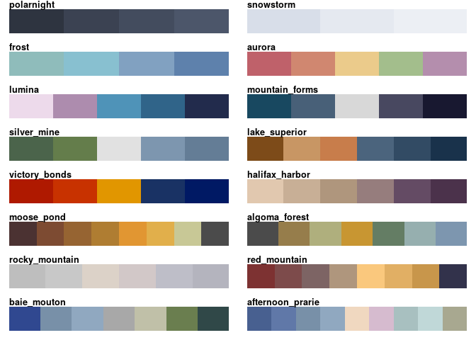
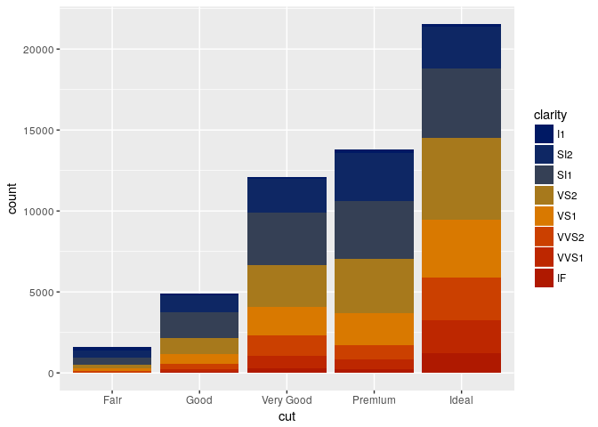
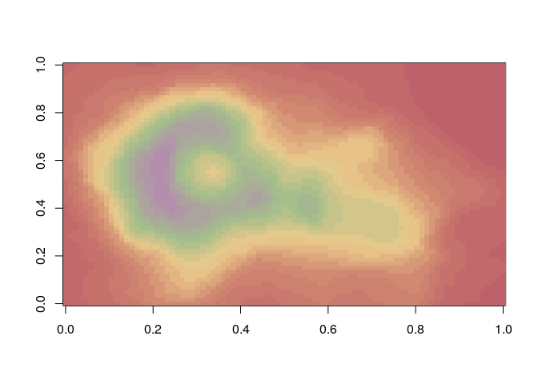
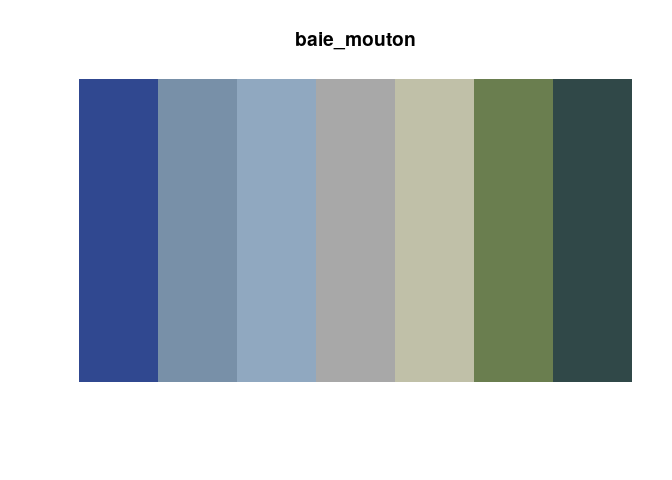

<!-- README.md is generated from README.Rmd. Please edit that file -->
nord: Northern-themed Color palettes
====================================

[](https://travis-ci.org/jkaupp/nord)[](https://ci.appveyor.com/project/jkaupp/nord)[](https://cran.r-project.org/package=nord)[](https://CRAN.R-project.org/package=nord)

The goal of nord is to provide access to many northern inspired palettes:

1.  4 colour palettes from [ArticIceStudio's Nord Palettes](https://git.io/nord)
2.  1 color palette extracted from [Lumina Borealis](https://www.luminaborealis.com/)
3.  11 colour palettes extracted from the works of the [Group of Seven](https://en.wikipedia.org/wiki/Group_of_Seven_(artists)).

These palettes can be used both with `ggplot2`, `lattice` and base R plotting to provide color to charts and graphics. The palettes in `nord` try to split equally between qualitative, sequential and diverging data, similar to the categories used in [ColorBrewer](http://colorbrewer2.org/). Further information and use of each palette can be found in the vignette.

Installation
------------

You can install nord from CRAN:

``` r
install.packages("nord")
```

or you can install the development version of nord from github with:

``` r
# install.packages("devtools")
devtools::install_github("jkaupp/nord")
```

The Palettes of `nord`
----------------------

``` r
library(nord)
library(purrr)

par(mfrow=c(8, 2), lheight = 2, mar=rep(1, 4), adj = 0)

walk(names(nord_palettes), nord_show_palette)
```



Example
-------

This is a basic example which shows you how to use the different features in `nord`:

Here is how to use `scale_fill_nord()` with `ggplot2`

``` r
library(ggplot2)
library(nord)

ggplot(diamonds) + 
  geom_bar(aes(x = cut, fill = clarity)) +
  scale_fill_nord("victory_bonds")
```



Here is using the `nord` function, with built in color-ramping, with the obligatory base r volcano.

``` r
image(volcano, col = nord("aurora", 20))
```



You can view the individual palettes in `nord` via `nord_show_palette()`

``` r
nord_show_palette("baie_mouton")
```



Acknowledgements
----------------

I started building this package long ago, as part of my own personal utility packages, as I have been using the nord palettes from ArcticIce Studioes for quite some time. A few months ago, I read something on the interwebs stating that work you did that was still private was pretty much a waste, so share it openly. That struck a chord. Then I read Maelle Salmon's ["How to Develop Good R Packages (for open science)"](http://www.masalmon.eu/2017/12/11/goodrpackages/), and was introduced to `usethis`, `styler` and `goodpractice`. That was the catalyst for making this package.

I drew inspiration from many color palette packages out there (`viridis`, `ochRe`, `swatches`, `wesanderson`, `RColorBrewer`), and used a lot of the functions to modernize, streamline and finally create `nord`.

Referenced Work from the Group of Seven
---------------------------------------

-   Forest, Algoma by Arthur Lismer
-   Entrance to Halifax Harbor by AY Jackson
-   Baie des Moutons by Edwin Holgate
-   Moose Pond by Frank H Johnston
-   A Northern Silver Mine by Franklin Carmichael
-   The Cloudy Red Mountain by Frederick H Varley
-   Give Us the Tools by AJ Casson
-   Mountain Forms by Lawren S. Harris
-   Afternoon Sun Lake Superior by Lawren S. Harris
-   Goat Range Rocky Mountain by JEH MacDonald
-   Sunny Afternoon Prarie by Lionel LeMoine Fitzgerald
